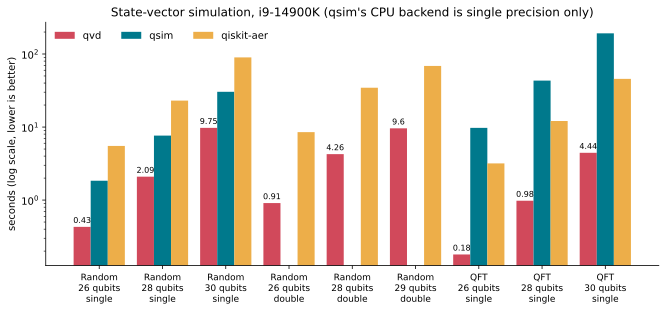
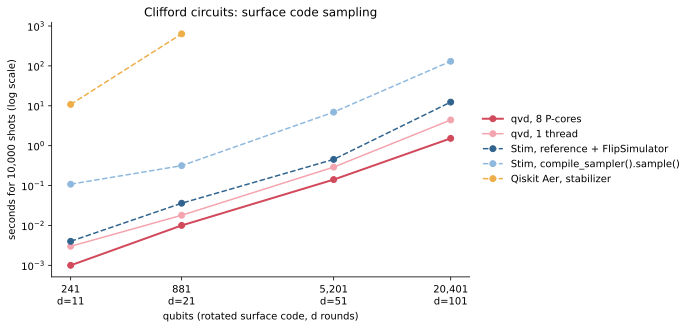
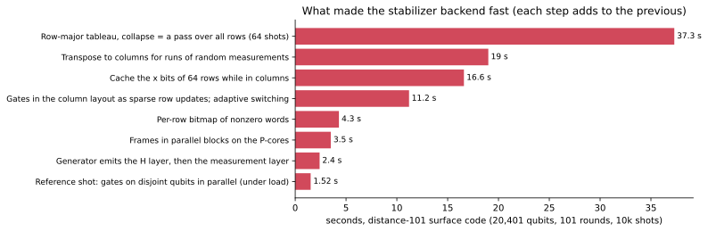
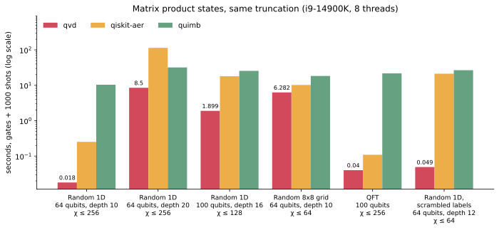
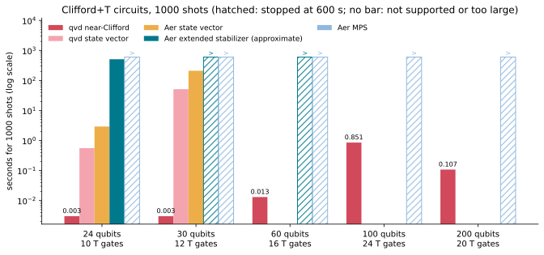

# Benchmarks

Recorded results, the scripts that produced them, and the charts drawn from
them. Every comparison runs the same OpenQASM file, written by qvd, through
each simulator.

```
benchmarks/
├── results/
│   ├── machine.json            hardware, versions, measurement notes
│   ├── statevector.csv         dense simulation: qvd vs qsim vs Qiskit Aer
│   ├── stabilizer.csv          Clifford circuits: qvd vs Stim vs Qiskit Aer
│   ├── mps.csv                 matrix product states: qvd vs Qiskit Aer vs quimb
│   ├── nearclifford.csv        Clifford+T circuits: qvd vs Qiskit Aer
│   └── stabilizer_steps.csv    how each optimisation changed the d=101 time
├── charts/                     SVGs drawn from results/ by plot.py
├── compare.py                  times Qiskit Aer and qsim on a QASM file
├── compare_stim.py             times Stim and Qiskit Aer's stabilizer method
├── compare_mps.py              times Qiskit Aer's and quimb's MPS simulators
├── compare_nearclifford.py     times Qiskit Aer's methods on Clifford+T circuits
└── plot.py                     results/*.csv -> charts/*.svg
```

The CSV files are in long format (one row per simulator and case), with
times in seconds, so they can be loaded directly by other tools or pages.

## Machine

Intel Core i9-14900K (8 P-cores with hyper-threading + 16 E-cores, 32
threads, AVX2 + FMA, no AVX-512), 62 GB DDR5, Linux 7.0, Rust 1.96. Python
packages: qiskit 2.5.2, qiskit-aer 0.17.2, qsimcirq 0.22.1, cirq-core 1.7.0,
stim 1.16.0, quimb 1.15.0. Measured on 2026-10-09.

## State-vector simulation



Random circuits are depth-20 Google-style circuits (√X, √Y, √W on every
qubit and CZ on a brick pattern); QFT is the quantum Fourier transform.
Each simulator gets its best of 16 or 32 threads. qvd's times include
allocating the state; the others include sampling one shot, and qsim's
include converting the circuit in Python. qsim's CPU backend is single
precision only. Amplitudes agree with Qiskit Aer to 7×10⁻¹³ in double
precision.

## Clifford circuits



Rotated surface-code memory experiments, d rounds, 10,000 shots. qvd ran
on a pool of 8 P-cores and on one thread; Stim is single-threaded. Stim is
timed two ways:
- `reference_sample()` plus a `FlipSimulator`, whose results are
  measurement-major like qvd's (the fair comparison);
- `compile_sampler().sample(bit_packed=True)`, which returns shot-major
  arrays and is much slower at these sizes.

Qiskit Aer's stabilizer method was not run past d = 21 (it took 636 s
there). A virtual machine shared the machine: Stim, Aer and qvd on one
thread ran while it used about six cores, and qvd on 8 P-cores was
re-measured after the parallel reference shot while it used about 14. So
absolute times are a little high, and pessimistic for qvd's 8-core column.



The steps that took the distance-101 code (20,401 qubits, 101 rounds) from
37 s to 1.5 s. Steps 1–7 were measured on a quiet machine. Step 8 was
measured under the heavier load; under that same load the build before it
took 2.57 s. [docs/DESIGN.md](../docs/DESIGN.md)
explains each one.

## Matrix product states



1000 shots, χ capped as labelled and the smallest singular values dropped
while their squares sum below 10⁻¹⁶, in all three simulators. qvd ran on 8
P-cores (best of three), Qiskit Aer with 8 threads, quimb's
`CircuitPermMPS` with 8 BLAS threads after a warm-up. Aer reports only a
total; `mps.csv` has gate and sampling times for the other two, and the
fidelity estimates. A busy virtual machine shared the machine during these
runs, for all three alike.

## Clifford+T circuits



Random Clifford+T circuits from `library::random_clifford_t` (layers of
random one-qubit Cliffords and CX on random pairs, T gates on random
qubits), 1000 shots, 8 threads. qvd's near-Clifford time is the best of
three; every Aer method ran in its own process, stopped at 600 s. Aer's
`extended_stabilizer` is approximate and rejects circuits over 63 qubits;
there is no state vector past 30 qubits. A virtual machine shared the
machine during these runs.

## Reproducing

```sh
python3 -m venv .bench-venv
.bench-venv/bin/pip install qiskit qiskit-aer qsimcirq cirq-core ply stim matplotlib quimb

# State vector: qvd's time is printed; the QASM file feeds the others.
cargo run --release --example bench -- random 28 20 f32 4 14 --qasm /tmp/c.qasm
.bench-venv/bin/python benchmarks/compare.py /tmp/c.qasm --precision single --threads 32

# Clifford: surface code of distance 51, 51 rounds, 10,000 shots.
cargo run --release --example stabilizer -- surface 51 51 10000 --qasm /tmp/s.qasm
.bench-venv/bin/python benchmarks/compare_stim.py /tmp/s.qasm --shots 10000

# MPS: 64 qubits, depth 20, χ ≤ 256, 1000 shots.
cargo run --release --example mps -- random 64 20 256 1000 --qasm /tmp/m.qasm
.bench-venv/bin/python benchmarks/compare_mps.py /tmp/m.qasm --max-bond 256 --shots 1000

# Clifford+T: 100 qubits, depth 30, 24 T gates, 1000 shots.
cargo run --release --example nearclifford -- 100 30 24 1000 --qasm /tmp/n.qasm
.bench-venv/bin/python benchmarks/compare_nearclifford.py /tmp/n.qasm --shots 1000 \
    --methods matrix_product_state,extended_stabilizer

# After editing results/*.csv:
.bench-venv/bin/python benchmarks/plot.py
```

`bench` takes the circuit (`random`, `qft`, `ghz`), qubits, depth, precision
(`f32`, `f64`), maximum fused qubits and region bits (0 turns cache blocking
off); `QVD_PLACEMENT=pcores|pthreads|allcores|all` selects the threads. The
`stabilizer` example takes `surface <distance> <rounds> <shots>` or
`random <qubits> <depth> <shots>`; `QVD_THREADS=pcores|all|<n>` selects the
threads (P-cores by default). The `mps` example takes
`<random|grid|qft|ghz> <qubits | ROWSxCOLS> <depth> <max bond> [shots]`, and
the `nearclifford` example `<qubits> <depth> <T count> [shots] [--backend nc|sv|mps]`.
